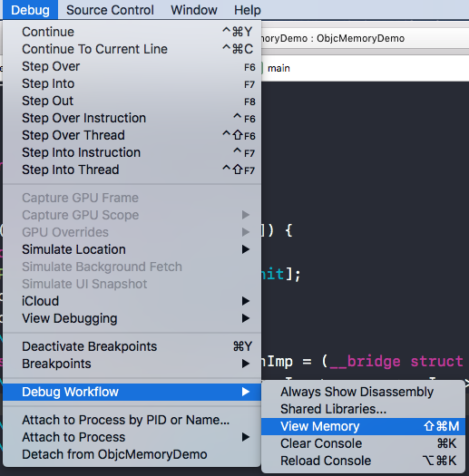

## 1. NSObject对象

我们再`Xcode`中编写的`Objective-C`代码, 底层是转换为C/C++代码, `OC`中的对象和类主要是基于C/C++中的结构体实现的.

  

创建一个`Command Line Tool`, 代码如下

```Objc
int main(int argc, const char * argv[]) {
    @autoreleasepool {
        NSObject *obj = [[NSObject alloc] init];
        NSLog(@"%@", obj);
    }
    return 0;
}
```

将`OC`代码转换为C++文件, 查看代码的本质. 在main.m文件所在目录执行如下代码.

```
xcrun -sdk iphoneos clang -arch arm64 -rewrite-objc main.m -o main-arm64.cpp
```

会生成main-arm64.cpp文件, 在main-arm64.cpp中搜索`NSObject`

```Objc
struct NSObject_IMPL {
Class isa;
};
```

`NSObject_IMPL`就是`NSObject`的内部实现. 这个结构体中只有一个Class类型的isa.

```
typedef struct objc_class *Class;
```

Class是一个指向结构体的指针, NSObject对象的本质就是, 内部有一个指向结构体的isa指针.

## 2. 自定义对象的内存结构

使用同样的方法将OC代码转为C++代码

```
struct Person_IMPL {
struct NSObject_IMPL NSObject_IVARS;
int _no;
int _age;
};
```

我们已知`NSObject`类的本质是一个指向结构体的指针.

```
struct Person_IMPL {
    class isa;
    int _no;
    int _age;
};
```

为了验证`Person`类的本质, 创建一个`WYL_Person_IMPL`结构体.

```
struct WYL_Person_IMPL {
    Class isa;
    int _no;
    int _age;
};
```

将创建的`Person`对象强转为指向`WYL_Person_IMPL`结构体的指针.

```
int main(int argc, const char * argv[]) {
    @autoreleasepool {
        Person *p = [[Person alloc] init];
        p->_no = 10;
        p->_age = 20;
        NSLog(@"%@", p);
        struct WYL_Person_IMPL *personImp = (__bridge struct WYL_Person_IMPL *)p;
        NSLog(@"no:%zd, age:%zd", personImp->_no, personImp->_age);
    }
    return 0;
}
```

我们把指向Person对象的指针p, 强制指向结构体, Person对象在内存中的布局和结构体在内存中的布局相同.

## 3. OC对象的分类

OC中的对象可以分为 instance实例对象 class类对象 meta-class元类对象

### 3.1 实例对象

instace实例对象: 通过调用类的alloc方法创建的对象.

```
        NSObject *obj1 = [[NSObject alloc] init];
        NSObject *obj2 = [[NSObject alloc] init];
```

obj1和obj2是两个实例对象, 他们的内存地址不同. 为了查看obj1和obj2的isa指针的值, 可以查看obj1和obj2的内存结构.



> 通过查看内存数据, 前八个字节为isa指针, 比较obj1和obj2的isa指针相同.

实例对象的内存结构为 isa指针+成员变量


*那么isa指针指向的是什么呢?*

### 3.2 类对象

class类对象: 可以通过class方法和runtime方法获取一个类的类对象.

```
        NSObject *obj1 = [[NSObject alloc] init];
        NSObject *obj2 = [[NSObject alloc] init];
        
        // 一个类的类对象在内存中只有一份 class返回的一直都是类对象
        Class classObject1 = [obj1 class];
        Class classObject2 = [NSObject class];
        Class classObject3 = object_getClass(obj1);
        NSLog(@"%p--%p--%p", classObject1, classObject2, classObject3);
```

通过`[obj1 class]`获取obj1的类对象, 打印obj1和obj2的类对象的内存地址, 两者的内存地址相同.
**每一个类在内存中只有一个class类对象**


### 3.3 元类对象

```
        NSObject *obj1 = [[NSObject alloc] init];
        NSObject *obj2 = [[NSObject alloc] init];
        
        Class obj1MetaClass = object_getClass([obj1 class]);
        Class obj2MetaClass = object_getClass([obj2 class]);
        
        NSLog(@"%p", obj1MetaClass);
        NSLog(@"%p", obj2MetaClass);
```

每一个类在内存中有且只有一个元类对象, 元类对象的结构和类对象在内存中的结构相同.


## 4.isa指针

先附上一幅最经典的图


## 5. struce objc_class的结构

在objc4的源码中查看`objc_object`的结构

```
struct objc_object {
    Class _Nonnull isa  OBJC_ISA_AVAILABILITY;
};
```

> 单纯的object就只有一个isa指针

`objc_class`结构体继承自`objc_object`

```
struct objc_class : objc_object {
    // Class ISA;
    Class superclass;
    cache_t cache;             // formerly cache pointer and vtable     方法缓存
    class_data_bits_t bits;    // class_rw_t * plus custom rr/alloc flags  用于获取具体的类信息

    class_rw_t *data() { 
        return bits.data();
    }
    ...
}
```

`class_data_bigs_t`存储着类的具体信息, 通过`data()`方法获取具体类信息, 返回的类型是`class_rw_t`类型
来看一下`class_rw_t`的数据结构

```
struct class_rw_t {
    // Be warned that Symbolication knows the layout of this structure.
    uint32_t flags;
    uint32_t version;

    const class_ro_t *ro;

    method_array_t methods; // 方法列表
    property_array_t properties; // 属性列表
    protocol_array_t protocols; // 协议列表

    Class firstSubclass;
    Class nextSiblingClass;

    char *demangledName;
    ...
    class_rw_t* data() {
        return (class_rw_t *)(bits & FAST_DATA_MASK);
    }
    ...
}
```

通过`data()`获取数据的的时候, 是通过与`FAST_DATA_MASK`做位运算, `FAST_DATA_MASK`的值为`0x00007ffffffffff8UL`

`class_rw_t`中存储着方法列表 属性列表 协议列表, 成员变量是存储在`class_ro_t`结构体中

```
struct class_ro_t {
    uint32_t flags;
    uint32_t instanceStart;
    uint32_t instanceSize;
#ifdef __LP64__
    uint32_t reserved;
#endif

    const uint8_t * ivarLayout;
    
    const char * name;
    method_list_t * baseMethodList;
    protocol_list_t * baseProtocols;
    const ivar_list_t * ivars; // 成员变量列表

    const uint8_t * weakIvarLayout;
    property_list_t *baseProperties;

    method_list_t *baseMethods() const {
        return baseMethodList;
    }
};
```

在`class_ro_t`结构体中存储着成员变量列表.

